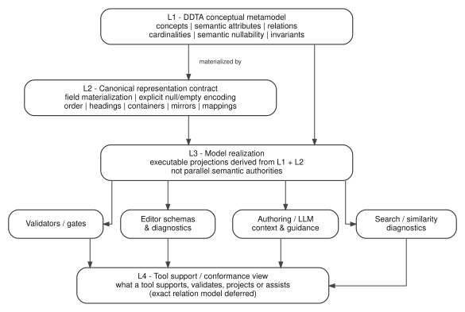

# DDTA - Working Model Layering and Semantic Authority

**NON-CANONICAL WORKING DRAFT - REVISION 1**

This document separates concerns that were previously co-located in the Decision study. The correction was triggered while regressing the facial-access example and the sixteen ThreatForge construction ADRs against Decision revision 6: rules about how tools consume a model had started to be used as if they were semantic invariants of the governed project model.

The correction does **not** reject the earlier representation or realization conclusions. It relocates them to the layer that actually owns them.

## 1. What the DDTA metamodel is

A governed project model is an instance of the DDTA conceptual metamodel. The conceptual metamodel defines the language in which governed project knowledge is expressed:

- concepts and semantic attributes;
- semantic relations and ownership;
- cardinalities and value domains;
- semantic nullability/optionality;
- invariants over one entity, a hierarchy, or the governed corpus.

For the current study this includes concepts such as Macro Requirement and Decision, their semantic fields, the `MR -> Decision` parent relation, and invariants such as unique semantic ownership and non-redundant Decision contribution.

The conceptual metamodel does **not** by itself prescribe a YAML syntax, a Markdown heading order, a validator architecture, an editor implementation, a similarity algorithm, or a particular tool.

## 2. Four distinct layers

```text
L1  DDTA CONCEPTUAL METAMODEL
    meaning | concepts | semantic attributes | relations
    cardinalities | semantic nullability | invariants

L2  CANONICAL REPRESENTATION CONTRACT
    how L1 instances are materialized in governed representations
    field presence | explicit null/empty encoding | order | headings
    containers | mirrors | YAML/Markdown mapping

L3  MODEL REALIZATION PRINCIPLES
    how software/automation consumes L1 + L2 without becoming
    a parallel semantic authority
    executable projections | validators | schemas | authoring support
    search/similarity diagnostics | derived indexes

L4  TOOL SUPPORT / CONFORMANCE MAPPING
    which DDTA contracts a tool such as ThreatForge supports,
    realizes, checks, projects or assists with
```

L4 is an evaluation/support layer, not a new claim that every relation named above must become a canonical metamodel relation. The exact support/coverage relation model remains deferred until the combined MR -> Decision -> Requirement model is available.



## 3. Reclassification of the Decision-study rules

| Historical rule | Correct owner after layering review | Current interpretation |
|---|---|---|
| `D-CLOSED-01` Purpose of Decision | L1 Decision semantics | Remains Decision-specific. |
| `D-CLOSED-02` Minimal semantic core | L1 Decision semantics | `title`, `context`, `decision`, `consequences` remain semantic attributes; all are required/non-null in the current Decision model. |
| `D-CLOSED-03` Decision-local Context | L1 Decision semantics | Remains Decision-specific. |
| `D-CLOSED-04` One coherent chosen position | L1 Decision invariant | Remains Decision-specific. |
| `D-CLOSED-05` Consequence awareness | L1 Decision semantics | Remains Decision-specific. |
| `D-CLOSED-06` No semantic patching | Authoring/review heuristic | Still useful, but not an ontological invariant or field of Decision. `Non-goals` remains outside the Decision semantic core. |
| `D-CLOSED-07` No mandatory embedded Alternatives/Rationale | L1 Decision semantic shape | Remains Decision-specific unless a future counterexample reopens it. |
| `D-CLOSED-08` Lifecycle is not Decision-specific | Cross-cutting L1 governance boundary | Lifecycle/status/history belong to a common governance model to be studied separately, not to Decision-specific semantics. |
| `D-CLOSED-09` Semantic-owner separation | Cross-cutting semantic-authority principle | Applies across MR/Decision/Requirement/tooling; it is not peculiar to Decision. |
| `H-CLOSED-01` Unique semantic ownership | L1 hierarchy invariant | Remains a metamodel invariant of `MR -> Decision`. |
| `H-CLOSED-02` Non-redundant Decision contribution | L1 corpus invariant | Remains a metamodel invariant of the governed Decision set. |
| `R-CLOSED-01` Complete-shape canonical representation | L2 representation contract | A declared canonical representation materializes every declared field. |
| `R-CLOSED-02` Explicit nullability / canonical empty values | Split L1/L2 | Whether a value may be semantically absent belongs to L1; how that absence is materially encoded belongs to L2. Missing declared structure is not silently equivalent to semantic absence. |
| `R-CLOSED-03` Semantic / representation separation | L1 <-> L2 boundary principle | Preserved as the rule that prevents syntax/layout from becoming ontology. |
| `R-CLOSED-04` Executable projections from one model | L3 realization principle | Preserved as a realization/design principle; **not** a semantic invariant of a governed DDTA project. |

Historical identifiers are retained so that the evidence sequence remains reconstructable. Their relocation must not be mistaken for rejection of the underlying conclusion.

## 4. Cross-cutting semantic authority

The study uses the following ownership distinction:

```text
DDTA conceptual metamodel / method
    owns portable general semantics and method-level choices

Governed project
    owns concrete governed instances and project-specific choices

ThreatForge tool
    supports authoring, resolution, validation, projection and workflow
    without becoming the semantic owner of DDTA concepts

ThreatForge project operations
    govern development of ThreatForge itself
    without becoming universal DDTA rules
```

The replacement test remains useful as a review heuristic: if ThreatForge were replaced by another tool, a statement that should remain true is likely owned by DDTA or by the governed project rather than by ThreatForge product architecture.

This principle does **not** imply that ThreatForge has no architectural Decisions. Once DDTA semantics are external, ThreatForge can still make genuine choices about how to support them.

## 5. Canonical representation contract

The representation contract materializes semantic models without redefining them.

### R-CLOSED-01 - Complete canonical shape

Every field declared by a canonical document representation is materially present in every conforming instance representation. A missing declared field is a representation non-conformity, not an implicit semantic value.

### R-CLOSED-02 - Semantic nullability versus material encoding

The semantic model decides whether a value may be absent. The representation profile decides how a permitted absence is encoded.

```text
semantic question:
    may assumptions have no value?
        -> L1

representation question:
    when absent, is the canonical materialization
    `assumptions: null` or another declared encoding?
        -> L2
```

A collection may have a semantically meaningful empty set; that is distinct from an absent value. Empty string is not a generic absence marker unless a field contract explicitly gives it that meaning.

### R-CLOSED-03 - Semantic / representation separation

Meaning, semantic types, relations, cardinalities and invariants remain independent from physical ordering, headings, containers, mirrors and serialization mappings. A Markdown order such as Context -> Decision -> Consequences may be mandatory for a profile without becoming an ontological ordering relation.

## 6. Model realization principles

### R-CLOSED-04 - Executable projections are realization, not metamodel semantics

Validators, editor contracts, authoring assistance, machine-readable schemas and other executable consumers should derive their interpretation from the governed model and representation contracts rather than maintain independent semantic inventories.

This is retained as a **realization principle** because it reduces semantic drift and enables deterministic support. It must not be used as if every governed DDTA project were semantically invalid when such tooling is absent.

Equally, the principle must not automatically eliminate a ThreatForge ADR. A ThreatForge Decision may legitimately choose *how* to realize executable contracts when multiple implementation strategies are plausible.

## 7. Scalable diagnostics are tooling

Large projects may require deterministic assistance for semantic review that is easy to perform manually in a small example. A tool may retrieve candidate overlaps or conflicts using BM25-style ranking, TF-IDF/cosine, fingerprints, term overlap, controlled-term normalization or another deterministic/indexable technique.

The metamodel owns the property to be reviewed, for example:

- one natural MR owner for a Decision;
- non-redundant Decision contribution.

The tool only narrows the candidate set. A similarity score does not establish semantic equivalence, duplication, conflict or correct parentage. Algorithm, tokenization, weighting and thresholds remain tooling choices.

## 8. Controlled vocabulary boundary

A controlled vocabulary, **if adopted**, is governed knowledge rather than an implementation detail of ThreatForge. Its canonical concepts and definitions must remain meaningful if the tool is replaced.

Tool mechanisms such as stemming, lexical normalization, ranking synonyms or search indexing remain L3 unless explicitly promoted into governed semantics.

The study has **not** yet established that every DDTA project must possess a controlled vocabulary. Its universal, optional, profile-specific or recommended status remains open.

## 9. ThreatForge support/conformance view

ThreatForge should eventually make explicit which DDTA contracts it supports without copying those contracts into its own MR/Decision prose as if it owned them.

A future support view may distinguish relations such as:

```text
supports authoring for
validates structural part of
projects
assists review of
realizes representation of
```

For example:

```text
DDTA H-CLOSED-01: exactly one semantic MR parent
    -> ThreatForge may validate structural cardinality
    -> ThreatForge may assist semantic parent review

DDTA H-CLOSED-02: non-redundant Decision contribution
    -> ThreatForge may retrieve suspiciously similar Decisions
    -> governed review still decides semantic redundancy
```

The exact canonical shape of this support/coverage information is deliberately deferred. It may ultimately live in Requirements, implementation trace, conformance evidence, or another relation model once those semantics are studied.

## 10. Consequence for ThreatForge ADR regression

A prior regression step treated `R-CLOSED-04` as if it were inherited semantic truth of the DDTA metamodel and therefore used it to dismiss some ThreatForge candidate ADRs as redundant. That reasoning is withdrawn.

The correct question for a ThreatForge ADR is now:

> Given the DDTA conceptual/representation contracts, does ThreatForge still face a meaningful choice among plausible ways to support or realize them?

If yes, the ADR may be a legitimate ThreatForge product Decision. If no, it may instead be a Requirement, consequence, support-coverage assertion or implementation detail.

At minimum, the candidates concerning controlled-value resolution, executable document-model contracts, Security-model support and registry-derived extensibility must be re-read under this corrected layering before their Decision status is finalized.

## 11. Open cross-document constraints retained

The following remain open problems for the combined governed-knowledge model rather than Decision fields or tooling algorithms:

- no orphan normative decision;
- single-source governed knowledge;
- effective governed context;
- Decision survivability and recoverability;
- coverage awareness for pervasive/cross-cutting obligations;
- no inheritance-by-copy;
- representation of legitimate cross-MR relevance without multiple hierarchical ownership.

Their minimal semantic relation model remains deferred until Requirement semantics is studied.
