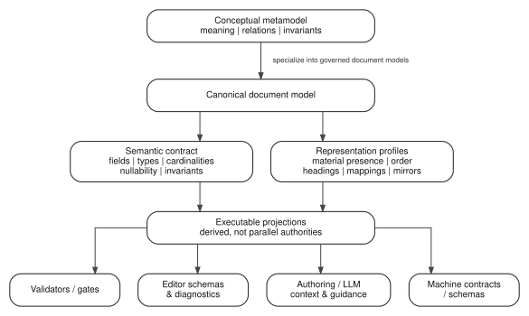

# DDTA - Working Metamodel - Decision

**NON CANONICAL WORKING DRAFT - REVISION 6**

Revision 6 keeps the local Decision core from revision 5 and incorporates the first cross-document correction exposed by the independent facial-access Phase D2 review.

Decision-specific fields remain:

```text
Decision
|- title
|- context
|- decision
`- consequences
```

New closed hierarchy/corpus invariants:

- **Unique semantic ownership** - every Decision has exactly one Macro Requirement that naturally owns the unresolved problem; ambiguous parentage requires review of the Decision or MR decomposition rather than duplicated ownership.
- **Non-redundant Decision contribution** - every Decision contributes a significant choice not already governed by another applicable Decision and not completely derivable from its parent plus existing Decisions.

Revision 6 explicitly separates these semantic invariants from large-corpus tooling. Similarity retrieval, BM25/TF-IDF-style ranking, fingerprints, term-overlap diagnostics or vocabulary-assisted normalization may help surface suspicious pairs, but they do not decide semantic duplication or parent ownership.

A controlled vocabulary, if adopted, is governed knowledge rather than a tool feature. ThreatForge or another tool may validate, resolve or use that vocabulary in derived search/index projections; whether controlled vocabulary is universally required by DDTA remains open.

The three validation levels are now:

```text
1. local Decision validity
2. MR -> Decision hierarchical coherence
3. Decision-corpus coherence
```

The complete revision-6 working text and review tests are in `DDTA_DECISION_METAMODEL_WORKING.pdf` and the LaTeX source.


