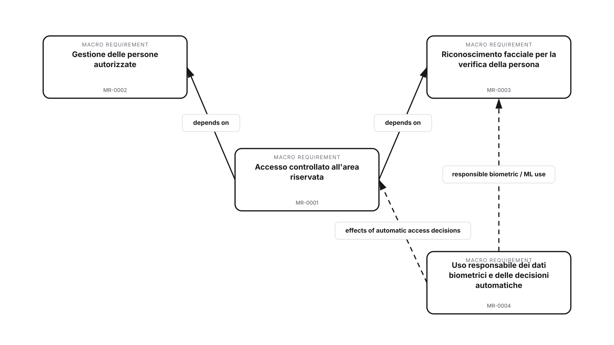
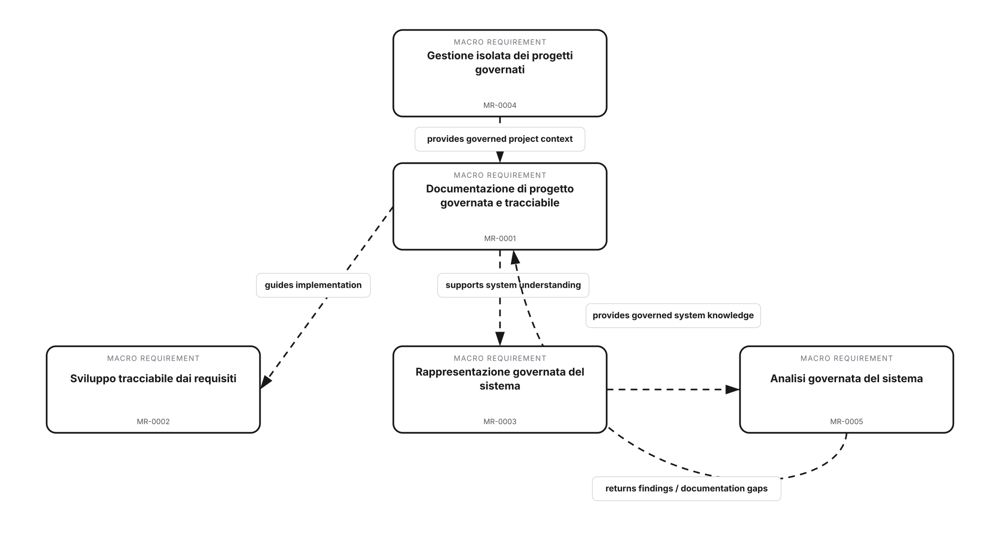

# MR teachability maps - working study

> **NON CANONICAL WORKING ARTIFACT**
>
> These maps test whether Macro Requirements can teach the macro functioning of a project before Decisions, architecture or analysis models are introduced. They are not DFDs and do not define canonical topology.

## Why keep a graphical projection at MR level

Documentation must not only preserve governed knowledge; it should help a new reader build a correct mental model progressively. `Title + Intent` provide the executive narrative, while a Macro Project Map can turn the MR set into a small block-level teaching aid.

The map is a **derived projection**. MR files remain authoritative.

## Semantic boundary

The map may contain:

- one block per Macro Requirement;
- canonical MR identity and title;
- explicit MR relations such as `dependsOn`;
- clearly marked non-canonical didactic links when needed for a teaching example and traceable to source text.

The map does not establish:

- software components or deployment nodes;
- data flows;
- DFD process/external-entity/data-store roles;
- trust boundaries;
- threat categories or analysis results.

## Facial-access example

The two solid links are explicit `dependsOn` relations from the access-control concern. The dashed links show a reviewed teaching interpretation of how the responsible-biometric/automatic-decision concern cuts across recognition and access effects. These dashed links are deliberately **not canonical MR topology**.

Textual reading:

1. controlled access depends on knowing who is authorized;
2. controlled access also depends on verifying the person;
3. biometric recognition and its automatic consequences raise a distinct responsible-use concern;
4. none of these statements determines where inference runs, which protocol is used or how devices are connected.

## ThreatForge example

ThreatForge's current candidate MR set can be taught as a macro cycle:

1. ThreatForge governs isolated projects;
2. governed documentation carries project knowledge;
3. that knowledge guides implementation and supports a governed representation of the system;
4. the representation can be analyzed through different methods;
5. analysis findings/documentation gaps return to the governed documentation lifecycle.

The candidate MR corpus does not currently encode all these explanatory links as explicit `dependsOn` records, so the ThreatForge map marks them as **non-canonical didactic interpretations**. This is useful evidence for the teachability test, not permission to silently create canonical relations.

## Teachability test

An MR set passes the working teachability test when a domain-competent reader new to the project can use the MRs to answer, without lower-level architecture:

- What are the project's main concerns?
- Why does each concern exist?
- How do the macro concerns collaborate or depend on each other?
- Can the reader explain the project's macro functioning from the map and textual equivalent?
- Would the explanation remain valid after a lower-level design Decision changes?

## Accessibility / BES-oriented presentation

The maps deliberately use:

- few blocks;
- canonical titles;
- one idea per block;
- labeled edges;
- no color-only semantics;
- textual equivalent and traceability in the HTML companions;
- progressive disclosure from MR map to later Decision/Requirement/system/analysis views.

## Rendering consistency with ThreatForge DFDs

The ThreatForge DFD renderer at planning SHA `44f77796469465a6a076596b1b1ba1afdde92db7` is a custom deterministic HTML/SVG renderer with renderer-neutral semantic input. The MR study maps imitate that visual/accessibility language but keep their own semantics. See `MR_MAP_RENDERING_COMPATIBILITY_NOTE.md`.

## Files in this folder

- `facial-access-macro-project-map.projection.json` - renderer-neutral study projection;
- `facial-access-macro-project-map.html` - accessible self-contained teaching view;
- `facial-access-macro-project-map.svg` / `.png` - static visual companions;
- `threatforge-macro-project-map.projection.json` - renderer-neutral study projection;
- `threatforge-macro-project-map.html` - accessible self-contained teaching view;
- `threatforge-macro-project-map.svg` / `.png` - static visual companions;
- `MR_MAP_RENDERING_COMPATIBILITY_NOTE.md` - inspected ThreatForge DFD rendering pattern and future reuse direction.
