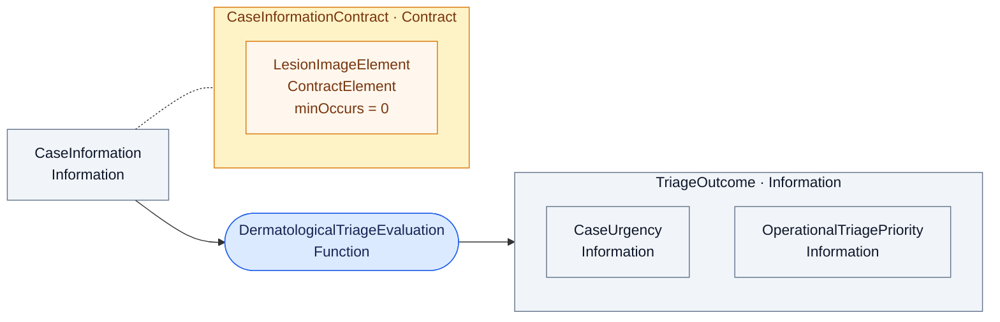

<!-- GENERATED FILE. Edit the Turtle source, SPARQL view, or YAML rules. -->
# MR-01-structure

```mermaid
%% Generated by DDTA RDF Mermaid pilot; edit Turtle/YAML, not this file.
flowchart LR
    n_c51cb132a1e4["CaseInformation<br/>Information"]
    class n_c51cb132a1e4 information
    subgraph sg_9ac441fde3b5["CaseInformationContract · Contract"]
        direction TB
        n_7ab664332c71["LesionImageElement<br/>ContractElement<br/>minOccurs = 0"]
        class n_7ab664332c71 element
    end
    style sg_9ac441fde3b5 fill:#fef3c7,stroke:#d97706,color:#78350f
    n_c032487bcd32(["DermatologicalTriageEvaluation<br/>Function"])
    class n_c032487bcd32 function
    subgraph sg_24422cafbeb9["TriageOutcome · Information"]
        direction TB
        n_3457c70ad524["CaseUrgency<br/>Information"]
        class n_3457c70ad524 information
        n_ab322f2f39ec["OperationalTriagePriority<br/>Information"]
        class n_ab322f2f39ec information
    end
    style sg_24422cafbeb9 fill:#f1f5f9,stroke:#64748b,color:#0f172a

    n_c51cb132a1e4 -.- sg_9ac441fde3b5
    n_c51cb132a1e4 --> n_c032487bcd32
    n_c032487bcd32 --> sg_24422cafbeb9

    classDef function fill:#dbeafe,stroke:#2563eb,color:#172554
    classDef information fill:#f1f5f9,stroke:#64748b,color:#0f172a
    classDef contract fill:#fef3c7,stroke:#d97706,color:#78350f
    classDef element fill:#fff7ed,stroke:#d97706,color:#78350f
```
