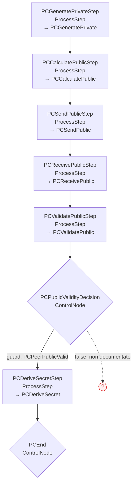

# PCProcess: Step e condizioni

Fonte: `../model/dh_r5a.ttl`. Schema illustrativo generato da relazioni RDF.

```mermaid
flowchart TB
    PCCalculatePublicStep["PCCalculatePublicStep<br/>ProcessStep<br/>→ PCCalculatePublic"]
    PCDeriveSecretStep["PCDeriveSecretStep<br/>ProcessStep<br/>→ PCDeriveSecret"]
    PCEnd{"PCEnd<br/>ControlNode"}
    PCGeneratePrivateStep["PCGeneratePrivateStep<br/>ProcessStep<br/>→ PCGeneratePrivate"]
    PCPublicValidityDecision{"PCPublicValidityDecision<br/>ControlNode"}
    PCReceivePublicStep["PCReceivePublicStep<br/>ProcessStep<br/>→ PCReceivePublic"]
    PCSendPublicStep["PCSendPublicStep<br/>ProcessStep<br/>→ PCSendPublic"]
    PCValidatePublicStep["PCValidatePublicStep<br/>ProcessStep<br/>→ PCValidatePublic"]
    PCGeneratePrivateStep --> PCCalculatePublicStep
    PCCalculatePublicStep --> PCSendPublicStep
    PCSendPublicStep --> PCReceivePublicStep
    PCReceivePublicStep --> PCValidatePublicStep
    PCValidatePublicStep --> PCPublicValidityDecision
    PCPublicValidityDecision -->|"guard: PCPeerPublicValid"| PCDeriveSecretStep
    PCDeriveSecretStep --> PCEnd
    PCInvalidPublicGap(("?"))
    PCPublicValidityDecision -.->|"false: non documentato"| PCInvalidPublicGap
    style PCInvalidPublicGap stroke:#dc2626,stroke-width:2px,stroke-dasharray:5 4,fill:#fff1f1,color:#b91c1c
```
