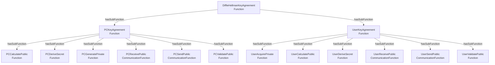

# Decomposizione funzionale

Fonte: `../model/dh_r5a.ttl`. Schema illustrativo generato da relazioni RDF.

```mermaid
flowchart TB
    DiffieHellmanKeyAgreement["DiffieHellmanKeyAgreement<br/>Function"]
    PCCalculatePublic["PCCalculatePublic<br/>Function"]
    PCDeriveSecret["PCDeriveSecret<br/>Function"]
    PCGeneratePrivate["PCGeneratePrivate<br/>Function"]
    PCKeyAgreement["PCKeyAgreement<br/>Function"]
    PCReceivePublic["PCReceivePublic<br/>CommunicationFunction"]
    PCSendPublic["PCSendPublic<br/>CommunicationFunction"]
    PCValidatePublic["PCValidatePublic<br/>Function"]
    UserAcquirePrivate["UserAcquirePrivate<br/>Function"]
    UserCalculatePublic["UserCalculatePublic<br/>Function"]
    UserDeriveSecret["UserDeriveSecret<br/>Function"]
    UserKeyAgreement["UserKeyAgreement<br/>Function"]
    UserReceivePublic["UserReceivePublic<br/>CommunicationFunction"]
    UserSendPublic["UserSendPublic<br/>CommunicationFunction"]
    UserValidatePublic["UserValidatePublic<br/>Function"]
    DiffieHellmanKeyAgreement -->|"hasSubFunction"| PCKeyAgreement
    DiffieHellmanKeyAgreement -->|"hasSubFunction"| UserKeyAgreement
    PCKeyAgreement -->|"hasSubFunction"| PCCalculatePublic
    PCKeyAgreement -->|"hasSubFunction"| PCDeriveSecret
    PCKeyAgreement -->|"hasSubFunction"| PCGeneratePrivate
    PCKeyAgreement -->|"hasSubFunction"| PCReceivePublic
    PCKeyAgreement -->|"hasSubFunction"| PCSendPublic
    PCKeyAgreement -->|"hasSubFunction"| PCValidatePublic
    UserKeyAgreement -->|"hasSubFunction"| UserAcquirePrivate
    UserKeyAgreement -->|"hasSubFunction"| UserCalculatePublic
    UserKeyAgreement -->|"hasSubFunction"| UserDeriveSecret
    UserKeyAgreement -->|"hasSubFunction"| UserReceivePublic
    UserKeyAgreement -->|"hasSubFunction"| UserSendPublic
    UserKeyAgreement -->|"hasSubFunction"| UserValidatePublic
```
