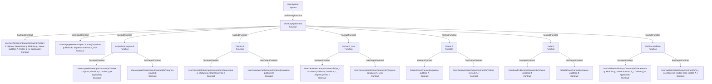

# UserSystem — funzioni e contratti

```mermaid
flowchart TB
    x_UserSystem["UserSystem<br/>System"]
    x_UserKeyAgreement["UserKeyAgreement<br/>Function"]
    x_UserKeyAgreementInputContract["UserKeyAgreementInputContract(br/)Valore b digitato, Generatore g, Modulus p, Valore pubblico A, Ordine q (se applicabile)<br/>Contract"]
    x_UserKeyAgreement -->|"hasInputContract"| x_UserKeyAgreementInputContract
    x_UserKeyAgreementOutputContract["UserKeyAgreementOutputContract(br/)Valore pubblico B, Segreto condiviso K_User<br/>Contract"]
    x_UserKeyAgreement -->|"hasOutputContract"| x_UserKeyAgreementOutputContract
    x_UserAcquirePrivate["Acquisisce segreto b<br/>Function"]
    x_UserAcquirePrivateInputContract["UserAcquirePrivateInputContract(br/)Valore b digitato, Modulus p, Ordine q (se applicabile)<br/>Contract"]
    x_UserAcquirePrivate -->|"hasInputContract"| x_UserAcquirePrivateInputContract
    x_UserAcquirePrivateOutputContract["UserAcquirePrivateOutputContract(br/)Segreto privato b<br/>Contract"]
    x_UserAcquirePrivate -->|"hasOutputContract"| x_UserAcquirePrivateOutputContract
    x_UserCalculatePublic["Calcola B<br/>Function"]
    x_UserCalculatePublicInputContract["UserCalculatePublicInputContract(br/)Generatore g, Modulus p, Segreto privato b<br/>Contract"]
    x_UserCalculatePublic -->|"hasInputContract"| x_UserCalculatePublicInputContract
    x_UserCalculatePublicOutputContract["UserCalculatePublicOutputContract(br/)Valore pubblico B<br/>Contract"]
    x_UserCalculatePublic -->|"hasOutputContract"| x_UserCalculatePublicOutputContract
    x_UserDeriveSecret["Deriva K_User<br/>Function"]
    x_UserDeriveSecretInputContract["UserDeriveSecretInputContract(br/)A_r accettato (richiesto), Modulus p, Segreto privato b<br/>Contract"]
    x_UserDeriveSecret -->|"hasInputContract"| x_UserDeriveSecretInputContract
    x_UserDeriveSecretOutputContract["UserDeriveSecretOutputContract(br/)Segreto condiviso K_User<br/>Contract"]
    x_UserDeriveSecret -->|"hasOutputContract"| x_UserDeriveSecretOutputContract
    x_UserReceivePublic["Riceve A<br/>Function"]
    x_PublicAOverChannel["PublicAOverChannel(br/)Valore pubblico A<br/>Contract"]
    x_UserReceivePublic -->|"hasInputContract"| x_PublicAOverChannel
    x_UserReceivePublicOutputContract["UserReceivePublicOutputContract(br/)Valore ricevuto A_r<br/>Contract"]
    x_UserReceivePublic -->|"hasOutputContract"| x_UserReceivePublicOutputContract
    x_UserSendPublic["Invia B<br/>Function"]
    x_UserSendPublicInputContract["UserSendPublicInputContract(br/)Valore pubblico B<br/>Contract"]
    x_UserSendPublic -->|"hasInputContract"| x_UserSendPublicInputContract
    x_PublicBOverChannel["PublicBOverChannel(br/)Valore pubblico B<br/>Contract"]
    x_UserSendPublic -->|"hasOutputContract"| x_PublicBOverChannel
    x_UserValidatePublic["Verifica validità A<br/>Function"]
    x_UserValidatePublicInputContract["UserValidatePublicInputContract(br/)Generatore g, Modulus p, Valore ricevuto A_r, Ordine q (se applicabile)<br/>Contract"]
    x_UserValidatePublic -->|"hasInputContract"| x_UserValidatePublicInputContract
    x_UserValidatePublicOutputContract["UserValidatePublicOutputContract(br/)A_r accettato (se valido), Esito validità A_r<br/>Contract"]
    x_UserValidatePublic -->|"hasOutputContract"| x_UserValidatePublicOutputContract
    x_UserSystem -->|"hasPrimaryFunction"| x_UserKeyAgreement
    x_UserKeyAgreement -->|"hasSubFunction"| x_UserAcquirePrivate
    x_UserKeyAgreement -->|"hasSubFunction"| x_UserCalculatePublic
    x_UserKeyAgreement -->|"hasSubFunction"| x_UserDeriveSecret
    x_UserKeyAgreement -->|"hasSubFunction"| x_UserReceivePublic
    x_UserKeyAgreement -->|"hasSubFunction"| x_UserSendPublic
    x_UserKeyAgreement -->|"hasSubFunction"| x_UserValidatePublic
```
