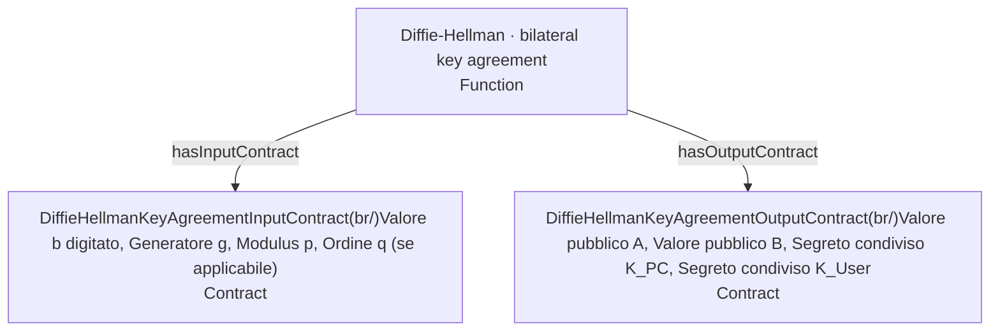

# Funzione complessiva — contratti

```mermaid
flowchart TB
    x_DiffieHellmanKeyAgreement["Diffie-Hellman · bilateral key agreement<br/>Function"]
    x_DiffieHellmanKeyAgreementInputContract["DiffieHellmanKeyAgreementInputContract(br/)Valore b digitato, Generatore g, Modulus p, Ordine q (se applicabile)<br/>Contract"]
    x_DiffieHellmanKeyAgreement -->|"hasInputContract"| x_DiffieHellmanKeyAgreementInputContract
    x_DiffieHellmanKeyAgreementOutputContract["DiffieHellmanKeyAgreementOutputContract(br/)Valore pubblico A, Valore pubblico B, Segreto condiviso K_PC, Segreto condiviso K_User<br/>Contract"]
    x_DiffieHellmanKeyAgreement -->|"hasOutputContract"| x_DiffieHellmanKeyAgreementOutputContract
```
