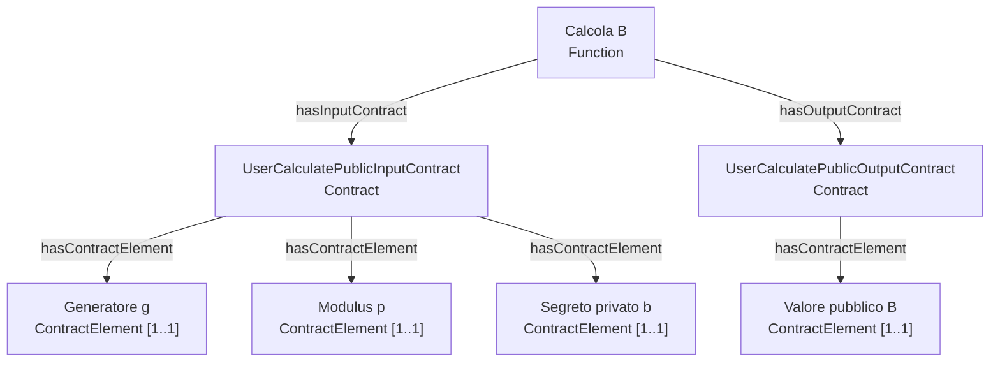

# UserCalculatePublic — contratti ed elementi

```mermaid
flowchart TB
    F["Calcola B<br/>Function"]
    Ci0["UserCalculatePublicInputContract<br/>Contract"]
    F -->|"hasInputContract"| Ci0
    Ei0_0["Generatore g<br/>ContractElement [1..1]"]
    Ci0 -->|"hasContractElement"| Ei0_0
    Ei0_1["Modulus p<br/>ContractElement [1..1]"]
    Ci0 -->|"hasContractElement"| Ei0_1
    Ei0_2["Segreto privato b<br/>ContractElement [1..1]"]
    Ci0 -->|"hasContractElement"| Ei0_2
    Co0["UserCalculatePublicOutputContract<br/>Contract"]
    F -->|"hasOutputContract"| Co0
    Eo0_0["Valore pubblico B<br/>ContractElement [1..1]"]
    Co0 -->|"hasContractElement"| Eo0_0
```
