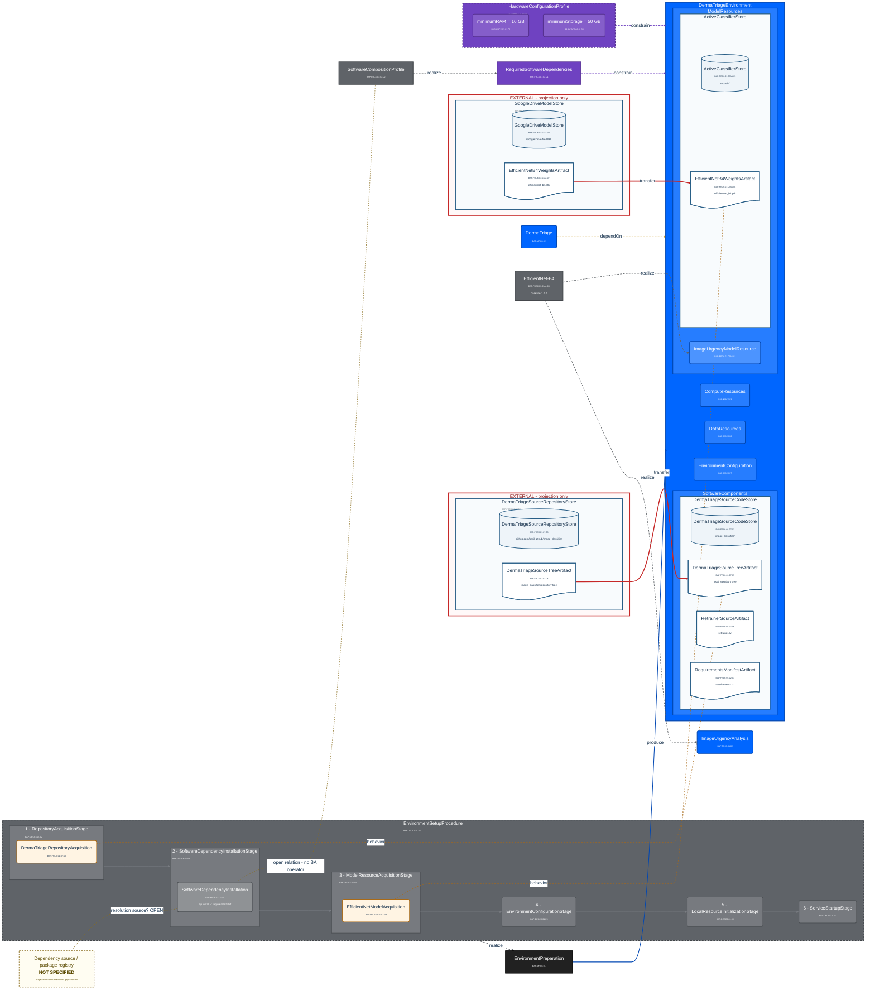

```mermaid
%%{init: {"theme":"base","themeVariables":{"background":"#FFFFFF","primaryColor":"#FFFFFF","primaryTextColor":"#17324D","primaryBorderColor":"#0047B3","lineColor":"#0047B3","edgeLabelBackground":"#FFFFFF"},"themeCSS":".cluster rect { rx:28px !important; ry:28px !important; } .edgeLabel p { background:#FFFFFF !important; border-radius:10px !important; padding:2px 7px !important; }"}}%%

flowchart LR

    EnvironmentPreparation["EnvironmentPreparation<br/><span style='font-size:7px;color:#FFFFFF'>BAP-MRC6-01</span>"]

    DermaTriage("DermaTriage<br/><span style='font-size:7px;color:#FFFFFF'>BAP-MRC6-02</span>")


    subgraph SECURITY_BOUNDARY_GITHUB["EXTERNAL - projection only"]
        direction TB

        subgraph HP_DermaTriageSourceRepositoryStore["DermaTriageSourceRepositoryStore<br/><span style='font-size:7px;color:#5B6770'>BAP-FRC6-01-07-04</span>"]
            direction TB

            DermaTriageSourceRepositoryStore[("DermaTriageSourceRepositoryStore<br/><span style='font-size:7px;color:#5B6770'>BAP-FRC6-01-07-03</span><br/><span style='font-size:9px'>github.com/basil-github/image_classifier</span>")]

            DermaTriageSourceTree_REMOTE@{ shape: doc, label: "DermaTriageSourceTreeArtifact<br/><span style='font-size:7px;color:#5B6770'>BAP-FRC6-01-07-04</span><br/><span style='font-size:9px'>image_classifier repository tree</span>" }
        end
    end


    subgraph SECURITY_BOUNDARY_GOOGLEDRIVE["EXTERNAL - projection only"]
        direction TB

        subgraph HP_GoogleDriveModelStore["GoogleDriveModelStore<br/><span style='font-size:7px;color:#5B6770'>BAP-FRC6-01-03A1-07</span>"]
            direction TB

            GoogleDriveModelStore[("GoogleDriveModelStore<br/><span style='font-size:7px;color:#5B6770'>BAP-FRC6-01-03A1-04</span><br/><span style='font-size:9px'>Google Drive file URL</span>")]

            EfficientNetWeights_REMOTE@{ shape: doc, label: "EfficientNetB4WeightsArtifact<br/><span style='font-size:7px;color:#5B6770'>BAP-FRC6-01-03A1-07</span><br/><span style='font-size:9px'>efficientnet_b4.pth</span>" }
        end
    end


    subgraph DermaTriageEnvironment["DermaTriageEnvironment"]
        direction TB

        ComputeResources("ComputeResources<br/><span style='font-size:7px;color:#FFFFFF'>BAP-MRC6-03</span>")


        subgraph SoftwareComponents["SoftwareComponents<br/><span style='font-size:7px;color:#FFFFFF'>BAP-MRC6-04</span>"]
            direction TB

            subgraph HP_DermaTriageSourceCodeStore["DermaTriageSourceCodeStore"]
                direction TB

                DermaTriageSourceCodeStore[("DermaTriageSourceCodeStore<br/><span style='font-size:7px;color:#5B6770'>BAP-FRC6-01-07-01</span><br/><span style='font-size:9px'>image_classifier/</span>")]

                DermaTriageSourceTree_LOCAL@{ shape: doc, label: "DermaTriageSourceTreeArtifact<br/><span style='font-size:7px;color:#5B6770'>BAP-FRC6-01-07-05</span><br/><span style='font-size:9px'>local repository tree</span>" }

                RetrainerSourceArtifact@{ shape: doc, label: "RetrainerSourceArtifact<br/><span style='font-size:7px;color:#5B6770'>BAP-FRC6-01-07-06</span><br/><span style='font-size:9px'>retrainer.py</span>" }

                RequirementsManifestArtifact@{ shape: doc, label: "RequirementsManifestArtifact<br/><span style='font-size:7px;color:#5B6770'>BAP-FRC6-01-02-03</span><br/><span style='font-size:9px'>requirements.txt</span>" }
            end
        end


        subgraph ModelResources["ModelResources<br/><span style='font-size:7px;color:#FFFFFF'>BAP-MRC6-05</span>"]
            direction TB

            ImageUrgencyModelResource("ImageUrgencyModelResource<br/><span style='font-size:7px;color:#FFFFFF'>BAP-FRC6-01-03A1-01</span>")

            subgraph HP_ActiveClassifierStore["ActiveClassifierStore"]
                direction TB

                ActiveClassifierStore[("ActiveClassifierStore<br/><span style='font-size:7px;color:#5B6770'>BAP-FRC6-01-03A1-05</span><br/><span style='font-size:9px'>models/</span>")]

                EfficientNetWeights_LOCAL@{ shape: doc, label: "EfficientNetB4WeightsArtifact<br/><span style='font-size:7px;color:#5B6770'>BAP-FRC6-01-03A1-08</span><br/><span style='font-size:9px'>efficientnet_b4.pth</span>" }
            end
        end


        DataResources("DataResources<br/><span style='font-size:7px;color:#FFFFFF'>BAP-MRC6-06</span>")

        EnvironmentConfiguration("EnvironmentConfiguration<br/><span style='font-size:7px;color:#FFFFFF'>BAP-MRC6-07</span>")
    end


    subgraph EnvironmentSetupProcedure["EnvironmentSetupProcedure<br/><span style='font-size:7px;color:#FFFFFF'>BAP-DECC6-01-01</span>"]
        direction TB

        subgraph RepositoryAcquisitionStage["1 - RepositoryAcquisitionStage<br/><span style='font-size:7px;color:#FFFFFF'>BAP-DECC6-01-02</span>"]
            direction TB

            DermaTriageRepositoryAcquisition("DermaTriageRepositoryAcquisition<br/><span style='font-size:7px;color:#17324D'>BAP-FRC6-01-07-02</span>")
        end


        subgraph SoftwareDependencyInstallationStage["2 - SoftwareDependencyInstallationStage<br/><span style='font-size:7px;color:#FFFFFF'>BAP-DECC6-01-03</span>"]
            direction TB

            SoftwareDependencyInstallation("SoftwareDependencyInstallation<br/><span style='font-size:7px;color:#FFFFFF'>BAP-FRC6-01-02-04</span><br/><span style='font-size:9px'>pip install -r requirements.txt</span>")
        end


        subgraph ModelResourceAcquisitionStage["3 - ModelResourceAcquisitionStage<br/><span style='font-size:7px;color:#FFFFFF'>BAP-DECC6-01-04</span>"]
            direction TB

            EfficientNetModelAcquisition("EfficientNetModelAcquisition<br/><span style='font-size:7px;color:#17324D'>BAP-FRC6-01-03A1-09</span>")
        end


        EnvironmentConfigurationStage("4 - EnvironmentConfigurationStage<br/><span style='font-size:7px;color:#FFFFFF'>BAP-DECC6-01-05</span>")

        LocalResourceInitializationStage("5 - LocalResourceInitializationStage<br/><span style='font-size:7px;color:#FFFFFF'>BAP-DECC6-01-06</span>")

        ServiceStartupStage("6 - ServiceStartupStage<br/><span style='font-size:7px;color:#FFFFFF'>BAP-DECC6-01-07</span>")


        RepositoryAcquisitionStage --> SoftwareDependencyInstallationStage
        SoftwareDependencyInstallationStage --> ModelResourceAcquisitionStage
        ModelResourceAcquisitionStage --> EnvironmentConfigurationStage
        EnvironmentConfigurationStage --> LocalResourceInitializationStage
        LocalResourceInitializationStage --> ServiceStartupStage
    end


    subgraph HardwareConfigurationProfile["HardwareConfigurationProfile<br/><span style='font-size:7px;color:#FFFFFF'>BAP-FRC6-01-01-05</span>"]
        direction TB

        MinimumRAM("minimumRAM = 16 GB<br/><span style='font-size:7px;color:#FFFFFF'>BAP-CRC6-01-01-01</span>")

        MinimumStorage("minimumStorage = 50 GB<br/><span style='font-size:7px;color:#FFFFFF'>BAP-CRC6-01-01-02</span>")
    end


    RequiredSoftwareDependencies["RequiredSoftwareDependencies<br/><span style='font-size:7px;color:#FFFFFF'>BAP-FRC6-01-02-01</span>"]

    SoftwareCompositionProfile["SoftwareCompositionProfile<br/><span style='font-size:7px;color:#FFFFFF'>BAP-FRC6-01-02-02</span>"]

    DependencySourceGap["Dependency source / package registry<br/><b>NOT SPECIFIED</b><br/><span style='font-size:8px'>projection of documentation gap - not BA</span>"]

    ImageUrgencyAnalysis("ImageUrgencyAnalysis<br/><span style='font-size:7px;color:#FFFFFF'>BAP-FR03-01-02</span>")

    EfficientNetB4["EfficientNet-B4<br/><span style='font-size:7px;color:#FFFFFF'>BAP-FRC6-01-03A1-03</span><br/><span style='font-size:9px'>baseline 1.0.0</span>"]


    EnvironmentPreparation -->|produce| DermaTriageEnvironment

    DermaTriage -.->|dependOn| DermaTriageEnvironment

    EnvironmentSetupProcedure -.->|realize| EnvironmentPreparation

    HardwareConfigurationProfile -.->|constrain| DermaTriageEnvironment

    RequiredSoftwareDependencies -.->|constrain| DermaTriageEnvironment

    SoftwareCompositionProfile -.->|realize| RequiredSoftwareDependencies

    SoftwareDependencyInstallation -.-|open relation - no BA operator| SoftwareCompositionProfile

    DependencySourceGap -.-|resolution source? OPEN| SoftwareDependencyInstallation

    EfficientNetB4 -.->|realize| ImageUrgencyModelResource

    EfficientNetB4 -.->|realize| ImageUrgencyAnalysis

    DermaTriageSourceTree_REMOTE -->|transfer| DermaTriageSourceTree_LOCAL

    EfficientNetWeights_REMOTE -->|transfer| EfficientNetWeights_LOCAL

    DermaTriageRepositoryAcquisition -.-|behavior| DermaTriageSourceTree_LOCAL

    EfficientNetModelAcquisition -.-|behavior| EfficientNetWeights_LOCAL


    classDef BAProduceActor fill:#212121,stroke:#000000,stroke-width:2px,color:#FFFFFF;

    classDef BAReferentD0 fill:#0066FF,stroke:#0047B3,stroke-width:2px,color:#FFFFFF;
    classDef BAReferentD1 fill:#267DFF,stroke:#0047B3,stroke-width:2px,color:#FFFFFF;
    classDef BAReferentD2 fill:#4C94FF,stroke:#0047B3,stroke-width:2px,color:#FFFFFF;

    classDef BARealizationD0 fill:#5F6368,stroke:#3F4347,stroke-width:2px,color:#FFFFFF;
    classDef BARealizationD1 fill:#777A7F,stroke:#4C5054,stroke-width:2px,color:#FFFFFF;
    classDef BARealizationD2 fill:#8F9295,stroke:#4C5054,stroke-width:2px,color:#FFFFFF;

    classDef BAConstrainD0 fill:#6F42C1,stroke:#55308F,stroke-width:2px,color:#FFFFFF;
    classDef BAConstrainD1 fill:#855ECA,stroke:#55308F,stroke-width:2px,color:#FFFFFF;

    classDef BAStore fill:#EEF4F9,stroke:#275D86,stroke-width:2px,color:#17324D;

    classDef BAContent fill:#FFFFFF,stroke:#275D86,stroke-width:2px,color:#17324D;

    classDef BATransferBehavior fill:#FFF4E3,stroke:#A96A16,stroke-width:2px,color:#17324D;

    classDef BADocumentationGap fill:#FFFDF2,stroke:#8A6D1D,stroke-width:1.8px,stroke-dasharray:5 4,color:#5B4A00;


    class EnvironmentPreparation BAProduceActor;

    class DermaTriage,ImageUrgencyAnalysis BAReferentD0;

    class ComputeResources,DataResources,EnvironmentConfiguration BAReferentD1;

    class ImageUrgencyModelResource BAReferentD2;

    class RequiredSoftwareDependencies BAConstrainD0;

    class SoftwareCompositionProfile,EfficientNetB4 BARealizationD0;

    class EnvironmentConfigurationStage,LocalResourceInitializationStage,ServiceStartupStage BARealizationD1;

    class SoftwareDependencyInstallation BARealizationD2;

    class MinimumRAM,MinimumStorage BAConstrainD1;

    class DermaTriageSourceRepositoryStore,DermaTriageSourceCodeStore,GoogleDriveModelStore,ActiveClassifierStore BAStore;

    class DermaTriageSourceTree_REMOTE,DermaTriageSourceTree_LOCAL,RetrainerSourceArtifact,RequirementsManifestArtifact,EfficientNetWeights_REMOTE,EfficientNetWeights_LOCAL BAContent;

    class DermaTriageRepositoryAcquisition,EfficientNetModelAcquisition BATransferBehavior;

    class DependencySourceGap BADocumentationGap;


    style DermaTriageEnvironment fill:#0066FF,stroke:#0047B3,stroke-width:2.5px,color:#FFFFFF

    style SoftwareComponents fill:#267DFF,stroke:#0047B3,stroke-width:2.3px,color:#FFFFFF

    style ModelResources fill:#267DFF,stroke:#0047B3,stroke-width:2.3px,color:#FFFFFF

    style SECURITY_BOUNDARY_GITHUB fill:#FFF8F8,stroke:#C62828,stroke-width:3px,color:#8B1A1A

    style SECURITY_BOUNDARY_GOOGLEDRIVE fill:#FFF8F8,stroke:#C62828,stroke-width:3px,color:#8B1A1A

    style HP_DermaTriageSourceRepositoryStore fill:#F8FBFD,stroke:#275D86,stroke-width:2.5px,color:#17324D

    style HP_DermaTriageSourceCodeStore fill:#F8FBFD,stroke:#275D86,stroke-width:2.5px,color:#17324D

    style HP_GoogleDriveModelStore fill:#F8FBFD,stroke:#275D86,stroke-width:2.5px,color:#17324D

    style HP_ActiveClassifierStore fill:#F8FBFD,stroke:#275D86,stroke-width:2.5px,color:#17324D

    style EnvironmentSetupProcedure fill:#5F6368,stroke:#3F4347,stroke-width:2.5px,stroke-dasharray:6 4,color:#FFFFFF

    style RepositoryAcquisitionStage fill:#777A7F,stroke:#4C5054,stroke-width:2px,color:#FFFFFF

    style SoftwareDependencyInstallationStage fill:#777A7F,stroke:#4C5054,stroke-width:2px,color:#FFFFFF

    style ModelResourceAcquisitionStage fill:#777A7F,stroke:#4C5054,stroke-width:2px,color:#FFFFFF

    style HardwareConfigurationProfile fill:#6F42C1,stroke:#55308F,stroke-width:2.5px,stroke-dasharray:6 4,color:#FFFFFF


    linkStyle 0 stroke:#7A7E83,stroke-width:1.3px;
    linkStyle 1 stroke:#7A7E83,stroke-width:1.3px;
    linkStyle 2 stroke:#7A7E83,stroke-width:1.3px;
    linkStyle 3 stroke:#7A7E83,stroke-width:1.3px;
    linkStyle 4 stroke:#7A7E83,stroke-width:1.3px;

    linkStyle 5 stroke:#0047B3,stroke-width:2px;

    linkStyle 6 stroke:#C69214,stroke-width:1.5px,stroke-dasharray:6 4;

    linkStyle 7 stroke:#5F6368,stroke-width:1.8px,stroke-dasharray:6 4;

    linkStyle 8 stroke:#6F42C1,stroke-width:1.8px,stroke-dasharray:6 4;

    linkStyle 9 stroke:#6F42C1,stroke-width:1.8px,stroke-dasharray:6 4;

    linkStyle 10 stroke:#5F6368,stroke-width:1.8px,stroke-dasharray:6 4;

    linkStyle 11 stroke:#8A6D1D,stroke-width:1.5px,stroke-dasharray:4 4;

    linkStyle 12 stroke:#8A6D1D,stroke-width:1.5px,stroke-dasharray:4 4;

    linkStyle 13 stroke:#5F6368,stroke-width:1.8px,stroke-dasharray:6 4;

    linkStyle 14 stroke:#5F6368,stroke-width:1.8px,stroke-dasharray:6 4;

    linkStyle 15 stroke:#C62828,stroke-width:3px;

    linkStyle 16 stroke:#C62828,stroke-width:3px;

    linkStyle 17 stroke:#A96A16,stroke-width:1.5px,stroke-dasharray:5 5;

    linkStyle 18 stroke:#A96A16,stroke-width:1.5px,stroke-dasharray:5 5;
```
