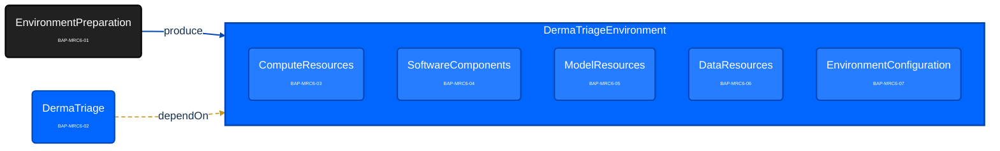

# MR-C6 — complete BA graph

```mermaid
%% DDTA PROJECTION SCOPE
%% BA analyses included: MR-C6
%% Scope status: COMPLETE for MR-C6
%% This graph is composed exclusively from the accepted BA analysis of MR-C6.
%% When the analysis is extended, derive a NEW cumulative file from this one
%% and declare the extended scope, e.g. MR-C6 + DEC-C6.
%% Do not add later-scope BA directly to this MR-C6 snapshot.

%%{init: {"theme":"base","themeVariables":{"background":"#FFFFFF","primaryColor":"#FFFFFF","primaryTextColor":"#17324D","primaryBorderColor":"#0047B3","lineColor":"#0047B3","edgeLabelBackground":"#FFFFFF"},"themeCSS":".cluster rect { rx:28px !important; ry:28px !important; } .edgeLabel p { border-radius:10px !important; padding:2px 7px !important; }"}}%%

flowchart LR

    %% ---------------------------------------------------------
    %% BA referents
    %% ---------------------------------------------------------
    EnvironmentPreparation("EnvironmentPreparation<br/><span style='font-size:7px;color:#FFFFFF'>BAP-MRC6-01</span>")

    DermaTriage("DermaTriage<br/><span style='font-size:7px;color:#FFFFFF'>BAP-MRC6-02</span>")

    subgraph DermaTriageEnvironment["DermaTriageEnvironment"]
        direction TB

        ComputeResources("ComputeResources<br/><span style='font-size:7px;color:#FFFFFF'>BAP-MRC6-03</span>")
        SoftwareComponents("SoftwareComponents<br/><span style='font-size:7px;color:#FFFFFF'>BAP-MRC6-04</span>")
        ModelResources("ModelResources<br/><span style='font-size:7px;color:#FFFFFF'>BAP-MRC6-05</span>")
        DataResources("DataResources<br/><span style='font-size:7px;color:#FFFFFF'>BAP-MRC6-06</span>")
        EnvironmentConfiguration("EnvironmentConfiguration<br/><span style='font-size:7px;color:#FFFFFF'>BAP-MRC6-07</span>")
    end

    %% ---------------------------------------------------------
    %% Relations
    %% ---------------------------------------------------------
    EnvironmentPreparation -->|produce| DermaTriageEnvironment
    DermaTriage -.->|dependOn| DermaTriageEnvironment

    %% ---------------------------------------------------------
    %% Styles
    %% ---------------------------------------------------------
    classDef BAProduceActor fill:#212121,stroke:#000000,stroke-width:2px,color:#FFFFFF;
    classDef BAReferentD0 fill:#0066FF,stroke:#0047B3,stroke-width:2px,color:#FFFFFF;
    classDef BAReferentD1 fill:#267DFF,stroke:#0047B3,stroke-width:2px,color:#FFFFFF;

    class EnvironmentPreparation BAProduceActor;
    class DermaTriage BAReferentD0;
    class ComputeResources,SoftwareComponents,ModelResources,DataResources,EnvironmentConfiguration BAReferentD1;

    style DermaTriageEnvironment fill:#0066FF,stroke:#0047B3,stroke-width:2.5px,color:#FFFFFF

    %% produce edge label
    linkStyle 0 stroke:#0047B3,stroke-width:2px;
    %% dependOn edge
    linkStyle 1 stroke:#C69214,stroke-width:1.5px,stroke-dasharray:6 4;
```
