<!--
DDTA PROJECTION SCOPE
Graph: MR-C6 + DEC-C6-01 + FR-C6-01-01 + CR-C6-01-01 - BA-derived cumulative working graph
BA analyses included: MR-C6 + DEC-C6-01 + FR-C6-01-01 + CR-C6-01-01
Scope status: COMPLETE through CR-C6-01-01
Derived from the complete MR-C6 + DEC-C6-01 snapshot.
Later analyses must derive a NEW cumulative file and declare the enlarged scope.
The previous MR-C6 and MR-C6 + DEC-C6-01 snapshots remain immutable.
-->

```mermaid
%%{init: {"theme":"base","themeVariables":{"background":"#FFFFFF","primaryColor":"#FFFFFF","primaryTextColor":"#17324D","primaryBorderColor":"#0047B3","lineColor":"#0047B3","edgeLabelBackground":"#FFFFFF"},"themeCSS":".cluster rect { rx:28px !important; ry:28px !important; } .edgeLabel p { background:#FFFFFF !important; border-radius:10px !important; padding:2px 7px !important; }"}}%%

flowchart LR

    EnvironmentPreparation["EnvironmentPreparation<br/><span style='font-size:7px;color:#FFFFFF'>BAP-MRC6-01</span>"]

    DermaTriage("DermaTriage<br/><span style='font-size:7px;color:#FFFFFF'>BAP-MRC6-02</span>")

    subgraph DermaTriageEnvironment["DermaTriageEnvironment"]
        direction TB

        ComputeResources("ComputeResources<br/><span style='font-size:7px;color:#FFFFFF'>BAP-MRC6-03</span>")
        SoftwareComponents("SoftwareComponents<br/><span style='font-size:7px;color:#FFFFFF'>BAP-MRC6-04</span>")
        ModelResources("ModelResources<br/><span style='font-size:7px;color:#FFFFFF'>BAP-MRC6-05</span>")
        DataResources("DataResources<br/><span style='font-size:7px;color:#FFFFFF'>BAP-MRC6-06</span>")
        EnvironmentConfiguration("EnvironmentConfiguration<br/><span style='font-size:7px;color:#FFFFFF'>BAP-MRC6-07</span>")
    end

    subgraph EnvironmentSetupProcedure["EnvironmentSetupProcedure<br/><span style='font-size:7px;color:#FFFFFF'>BAP-DECC6-01-01</span>"]
        direction TB

        RepositoryAcquisitionStage("1 - RepositoryAcquisitionStage<br/><span style='font-size:7px;color:#FFFFFF'>BAP-DECC6-01-02</span>")
        SoftwareDependencyInstallationStage("2 - SoftwareDependencyInstallationStage<br/><span style='font-size:7px;color:#FFFFFF'>BAP-DECC6-01-03</span>")
        ModelResourceAcquisitionStage("3 - ModelResourceAcquisitionStage<br/><span style='font-size:7px;color:#FFFFFF'>BAP-DECC6-01-04</span>")
        EnvironmentConfigurationStage("4 - EnvironmentConfigurationStage<br/><span style='font-size:7px;color:#FFFFFF'>BAP-DECC6-01-05</span>")
        LocalResourceInitializationStage("5 - LocalResourceInitializationStage<br/><span style='font-size:7px;color:#FFFFFF'>BAP-DECC6-01-06</span>")
        ServiceStartupStage("6 - ServiceStartupStage<br/><span style='font-size:7px;color:#FFFFFF'>BAP-DECC6-01-07</span>")

        RepositoryAcquisitionStage --> SoftwareDependencyInstallationStage
        SoftwareDependencyInstallationStage --> ModelResourceAcquisitionStage
        ModelResourceAcquisitionStage --> EnvironmentConfigurationStage
        EnvironmentConfigurationStage --> LocalResourceInitializationStage
        LocalResourceInitializationStage --> ServiceStartupStage
    end

    subgraph HardwareConfigurationProfile["HardwareConfigurationProfile<br/><span style='font-size:7px;color:#FFFFFF'>BAP-FRC6-01-01-05</span>"]
        direction TB

        MinimumRAM("minimumRAM = 16 GB<br/><span style='font-size:7px;color:#FFFFFF'>BAP-CRC6-01-01-01</span>")
        MinimumStorage("minimumStorage = 50 GB<br/><span style='font-size:7px;color:#FFFFFF'>BAP-CRC6-01-01-02</span>")
    end

    EnvironmentPreparation -->|produce| DermaTriageEnvironment
    DermaTriage -.->|dependOn| DermaTriageEnvironment
    EnvironmentSetupProcedure -.->|realize| EnvironmentPreparation
    HardwareConfigurationProfile -.->|constrain| DermaTriageEnvironment

    classDef BAProduceActor fill:#212121,stroke:#000000,stroke-width:2px,color:#FFFFFF;
    classDef BAReferentD0 fill:#0066FF,stroke:#0047B3,stroke-width:2px,color:#FFFFFF;
    classDef BAReferentD1 fill:#267DFF,stroke:#0047B3,stroke-width:2px,color:#FFFFFF;
    classDef BARealizationD1 fill:#777A7F,stroke:#4C5054,stroke-width:2px,color:#FFFFFF;
    classDef BAConstrainD1 fill:#855ECA,stroke:#55308F,stroke-width:2px,color:#FFFFFF;

    class EnvironmentPreparation BAProduceActor;
    class DermaTriage BAReferentD0;
    class ComputeResources,SoftwareComponents,ModelResources,DataResources,EnvironmentConfiguration BAReferentD1;
    class RepositoryAcquisitionStage,SoftwareDependencyInstallationStage,ModelResourceAcquisitionStage,EnvironmentConfigurationStage,LocalResourceInitializationStage,ServiceStartupStage BARealizationD1;
    class MinimumRAM,MinimumStorage BAConstrainD1;

    style DermaTriageEnvironment fill:#0066FF,stroke:#0047B3,stroke-width:2.5px,color:#FFFFFF
    style EnvironmentSetupProcedure fill:#5F6368,stroke:#3F4347,stroke-width:2.5px,stroke-dasharray:6 4,color:#FFFFFF
    style HardwareConfigurationProfile fill:#6F42C1,stroke:#55308F,stroke-width:2.5px,stroke-dasharray:6 4,color:#FFFFFF

    linkStyle 0 stroke:#7A7E83,stroke-width:1.3px;
    linkStyle 1 stroke:#7A7E83,stroke-width:1.3px;
    linkStyle 2 stroke:#7A7E83,stroke-width:1.3px;
    linkStyle 3 stroke:#7A7E83,stroke-width:1.3px;
    linkStyle 4 stroke:#7A7E83,stroke-width:1.3px;
    linkStyle 5 stroke:#0047B3,stroke-width:2px;
    linkStyle 6 stroke:#C69214,stroke-width:1.5px,stroke-dasharray:6 4;
    linkStyle 7 stroke:#5F6368,stroke-width:1.8px,stroke-dasharray:6 4;
    linkStyle 8 stroke:#6F42C1,stroke-width:1.8px,stroke-dasharray:6 4;
```

