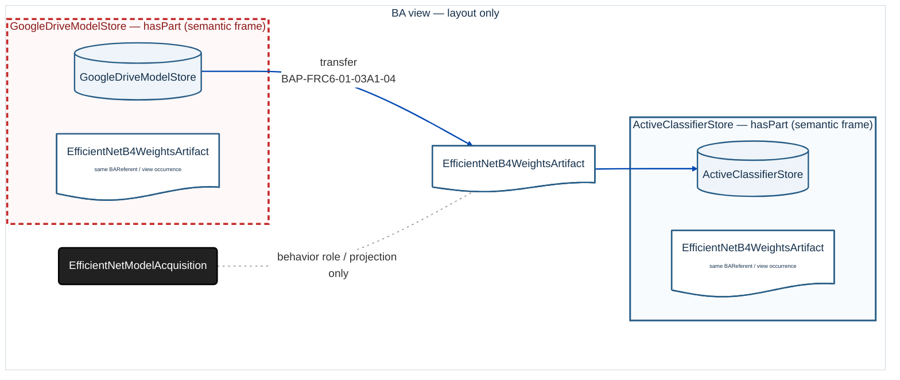

# EfficientNetB4WeightsArtifact — solo topologia BA (stile DDTA B)

Il frame bianco è esclusivamente grafico, non una relazione BA.

```mermaid
%%{init: {"theme":"base","themeVariables":{"background":"#FFFFFF","lineColor":"#171717","edgeLabelBackground":"#FFFFFF"}}}%%

flowchart LR

    %% Selected from structured BA Markdown: source is NOT the cumulative Mermaid.
    %% Profile B (verified in VS Code): R3 document icons, R50 actor/edge classes.
    %% BA_VIEW_WHITE is visual-only: not hasPart and not a trust boundary.
    subgraph BA_VIEW_WHITE["BA view — layout only"]
      direction LR
      subgraph HP_GoogleDriveModelStore["GoogleDriveModelStore — hasPart (semantic frame)"]
          direction TB
          R_GoogleDriveModelStore[("GoogleDriveModelStore")]
          O_BAP_FRC6_01_03A1_07@{ shape: doc, label: "EfficientNetB4WeightsArtifact<br/><span style='font-size:8px'>same BAReferent / view occurrence</span>" }
      end
      subgraph HP_ActiveClassifierStore["ActiveClassifierStore — hasPart (semantic frame)"]
          direction TB
          R_ActiveClassifierStore[("ActiveClassifierStore")]
          O_BAP_FRC6_01_03A1_08@{ shape: doc, label: "EfficientNetB4WeightsArtifact<br/><span style='font-size:8px'>same BAReferent / view occurrence</span>" }
      end
      R_EfficientNetB4WeightsArtifact@{ shape: doc, label: "EfficientNetB4WeightsArtifact" }
      R_EfficientNetModelAcquisition("EfficientNetModelAcquisition")

      R_GoogleDriveModelStore -->|"transfer<br/>BAP-FRC6-01-03A1-04"| R_EfficientNetB4WeightsArtifact
      R_EfficientNetB4WeightsArtifact --> R_ActiveClassifierStore
      R_EfficientNetModelAcquisition -.-|"behavior role / projection only"| R_EfficientNetB4WeightsArtifact
    end

    classDef BAProduceActor fill:#212121,stroke:#000000,stroke-width:2px,color:#FFFFFF;
    classDef BARealizationD2 fill:#8F9295,stroke:#4C5054,stroke-width:2px,color:#FFFFFF;
    classDef BAStore fill:#EEF4F9,stroke:#275D86,stroke-width:2px,color:#17324D;
    classDef BAContent fill:#FFFFFF,stroke:#275D86,stroke-width:2px,color:#17324D;
    classDef BALogicalData fill:#FFFFFF,stroke:#5C99C1,stroke-width:2px,color:#23313D;
    classDef BATransferBehavior fill:#FFF4E3,stroke:#A96A16,stroke-width:2px,color:#17324D;
    classDef BAGap fill:#FFFFFF,stroke:#C62828,stroke-width:3px,color:#C62828;
    style BA_VIEW_WHITE fill:#FFFFFF,stroke:#D4DCE3,stroke-width:1px,color:#17324D;
    class O_BAP_FRC6_01_03A1_07,O_BAP_FRC6_01_03A1_08,R_EfficientNetB4WeightsArtifact BAContent;
    class R_ActiveClassifierStore,R_GoogleDriveModelStore BAStore;
    class R_EfficientNetModelAcquisition BAProduceActor;
    style HP_GoogleDriveModelStore fill:#FFF8F8,stroke:#C62828,stroke-width:3px,stroke-dasharray:7 5,color:#8B1A1A;
    style HP_ActiveClassifierStore fill:#F8FBFD,stroke:#275D86,stroke-width:2.5px,color:#17324D;
    linkStyle 0 stroke:#0047B3,stroke-width:2px;
    linkStyle 1 stroke:#0047B3,stroke-width:2px;
    linkStyle 2 stroke:#909090,stroke-width:1.3px,stroke-dasharray:3 5;
```
